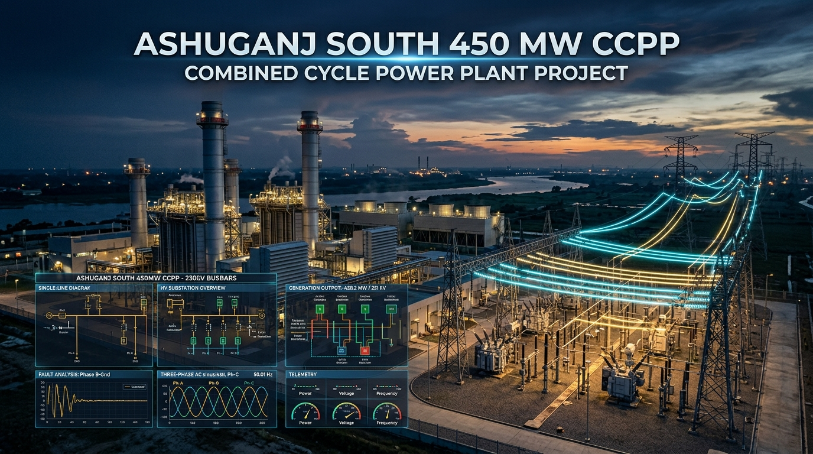

<div align="center">

<a href="https://www.youtube.com/watch?v=PSo1Ih-CXqg" target="_blank" title="Click to Watch the Complete Video Demonstration on YouTube">
  
</a>

# Ashuganj 450 MW Combined Cycle Power Plant (South) — Power System Analysis, IEC 60909 Fault Calculations & Protection Coordination

**Comprehensive Engineering Model, Steady-State Power Flow, Switchgear Duty Assessment, and Closed-Loop Simulink Dynamic Stability Simulation**

*BUET EEE 306: Power System I Laboratory Final Project | Lead Author: S. M. Sindid Islam Mahodi et al.*

[](https://www.youtube.com/watch?v=PSo1Ih-CXqg)
[](https://www.mathworks.com/products/matlab.html)
[](https://www.mathworks.com/products/simulink.html)
[](https://eee.buet.ac.bd/)
[](https://standards.ieee.org/)
[](LICENSE)
[](CITATION.cff)

<p align="center" style="margin-top: 15px;">
  <a href="https://www.youtube.com/watch?v=PSo1Ih-CXqg" target="_blank" style="font-size: 1.15em; font-weight: bold; color: #dc2626; text-decoration: none;">
    ▶️ Click Here to Watch the Complete Video Demonstration on YouTube (https://www.youtube.com/watch?v=PSo1Ih-CXqg)
  </a>
</p>

</div>

---

An exhaustive, industry-grade grid interconnection, steady-state power flow, symmetrical/unsymmetrical fault analysis, switchgear duty assessment, protection coordination, and closed-loop dynamic simulation of the **Ashuganj 450 MW (South) Combined Cycle Power Plant (CCPP)** operated by Ashuganj Power Station Company Limited (APSCL) in Brahmanbaria, Bangladesh.

Developed for **EEE 306: Power System I Laboratory**, Department of Electrical and Electronic Engineering (EEE), **Bangladesh University of Engineering and Technology (BUET)**.

---

## Table of Contents

- [Authors & Project Attribution](#authors--project-attribution)
- [Executive Summary & Plant Specifications](#executive-summary--plant-specifications)
- [Core Engineering Studies & Key Numerical Findings](#core-engineering-studies--key-numerical-findings)
  - [1. Steady-State Balanced Power Flow Analysis](#1-steady-state-balanced-power-flow-analysis)
  - [2. IEC 60909 Symmetrical & Unsymmetrical Short-Circuit Analysis](#2-iec-60909-symmetrical--unsymmetrical-short-circuit-analysis)
  - [3. Circuit Breaker Duty & Switchgear Assessment](#3-circuit-breaker-duty--switchgear-assessment)
  - [4. Protection Coordination & Relay Grading Schemes](#4-protection-coordination--relay-grading-schemes)
  - [5. Simulink Dynamic Simulation & Transient Stability](#5-simulink-dynamic-simulation--transient-stability)
- [Video Demonstration & Defense Walkthrough](#video-demonstration--defense-walkthrough)
- [Interactive HTML Documentation & Engineering Manuals](#interactive-html-documentation--engineering-manuals)
- [Repository Directory Structure](#repository-directory-structure)
- [Quick Start Guide: Running the MATLAB Simulation](#quick-start-guide-running-the-matlab-simulation)
- [Frequently Asked Questions (FAQ) & Search Query Index](#frequently-asked-questions-faq--search-query-index)
- [Technical Keyword Index & Search Terms Matrix](#technical-keyword-index--search-terms-matrix)
- [Academic Citation](#academic-citation)
- [License](#license)

---

## Authors & Project Attribution

### Project Team (Group 03, Section C-1)

| No. | Contributor Name | Student ID | Core Engineering Responsibility |
|:---:|---|:---:|---|
| **1** | **S. M. Sindid Islam Mahodi** | **2206147** | **Fault Analysis, Symmetrical Components & System Integration** |
| 2 | **Sasshata Talukder** | 2206136 | Power Flow & Protection Coordination |
| 3 | **Rajib Khan** | 2206152 | Network Modeling & Parameter Verification |
| 4 | **Iftekhar-E-Islam** | 2206153 | Simulink Dynamic Model & Relay Logic |
| 5 | **Abu Mohammed Ibn Julker Nahin** | 2206155 | Breaker Duty & Station DC System |

### Faculty Supervision & Academic Department
- **Course**: EEE 306: Power System I Laboratory (January 2026 Term)
- **Course Instructors**:
  - **Md. Kamrul Hasan**, Lecturer, Department of Electrical and Electronic Engineering (EEE), BUET
  - **Md. Mahadi Jaman**, Part-Time Lecturer, Department of Electrical and Electronic Engineering (EEE), BUET
- **Institution**: Department of Electrical and Electronic Engineering (EEE), **Bangladesh University of Engineering and Technology (BUET)**, Dhaka-1000, Bangladesh.

### Secondary Contributor & GitHub Collaborator
- **Gogetsu-hoz** ([@Gogetsu-hoz](https://github.com/Gogetsu-hoz)) — *Secondary Contributor & Technical Reviewer*

---

## Executive Summary & Plant Specifications

The **Ashuganj South 450 MW Combined Cycle Power Plant (CCPP)**, operated by Ashuganj Power Station Company Limited (APSCL), represents one of Bangladesh's premier baseload power generation facilities. This study establishes an authentic, engineering-grade computational model of the generating unit, generator step-up transformer (GSUT), 230 kV Gas-Insulated Substation (GIS), unit auxiliary systems, and multi-circuit transmission links to the national power grid.

```text
========================================================================================
                                 PLANT ONE-LINE TOPOLOGY
========================================================================================
   [ Siemens SGen5-2000H ]
       458 MVA, 22 kV
              |
       [ GCB 10BAC10 ]  (22 kV, 12.4 kA cont., 100 kA sym. breaking)
              |
              +--------------------------+
              |                          |
       [ 515 MVA GSUT ]          [ UAT 25 MVA ] & [ GAT 25 MVA ]
       22 kV / 230 kV            22 kV / 6.6 kV Station Auxiliaries
              |                          |
    [ 230 kV GIS Switchyard ]     [ 6.6 kV Switchboard ]
      (Double Busbar BB1/BB2)      Station Auxiliary Loads (14 MW)
              |
      2x 230 kV D/C Links (Mallard 795 MCM ACSR, 0.7 km)
              |
     [ National Grid Yard ]
        +-- Ghorasal 230 kV D/C
        +-- Comilla North 230 kV D/C
        +-- Sirajganj 230 kV D/C
        +-- Kishoreganj 230 kV D/C
        +-- 400/230 kV Intertie Autotransformers -> Bhulta 400 kV D/C (69 km)
========================================================================================
```

### Primary Equipment Nameplate & Verified Design Ratings
| Equipment | Nameplate / Design Rating | Key Electrical Parameters | Standard / Verification Source |
|---|---|---|---|
| **Turbogenerator** | Siemens SGen5-2000H, 458 MVA, 360 MW | 22 kV, 12.02 kA rated, pf 0.85, $H = 5.287\text{ s}$, $X_d'' = 0.169\text{ pu}$ | Plant Technical Datasheet |
| **GSUT** | 515 MVA (ODAF) / 355 MVA (ONAN), 22/230 kV | $Z = 16.0\%$, vector group YNd11, neutral solidly grounded | Transformer Rating Plate |
| **Generator Breaker (GCB)** | ABB/Siemens 10BAC10, 22 kV | 12.4 kA continuous, 100 kA symmetrical rms breaking | Plant As-built Single-Line Diagram |
| **230 kV GIS Switchgear** | Siemens SF6 GIS (BB1 & BB2, Coupler 10BAY13) | 2000 A bay / 3150 A coupler, 50 kA sym., 125 kA peak withstand | Siemens GIS Engineering Documentation |
| **Auxiliary Transformers** | UAT & GAT: 25 MVA each, 22/6.6 kV | $Z_{UAT} = 10.5\%$, $Z_{GAT} = 12.0\%$, Dy11 | Plant Auxiliary Datasheet |
| **Generator Neutral Grounding** | Distribution Transformer with NER | $R_{NER} = 1750.8\ \Omega$ primary equivalent, limits ground fault to 7.27 A | IEEE C37.102 Standard Sizing |
| **Station DC System** | Lead-acid battery 110 V, 200 Ah | Dual 20 kW redundant chargers, 180 A ceiling | IEEE 485 / IEC 60896 |

---

## Core Engineering Studies & Key Numerical Findings

### 1. Steady-State Balanced Power Flow Analysis
- **Scenarios Investigated**:
  1. *Full Base Load Export (345 MW at 230 kV Grid Boundary)*
  2. *Summer Peak Stressed Grid Export*
  3. *Winter Off-Peak Light Load Scenario*
  4. *Generator Islanding / Station Blackstart Condition*
- **Key Findings**:
  - GSUT operating point sits comfortably at **72.98% of ODAF** (515 MVA rating) and 105.87% of ONAN base, validating continuous forced-oil directed-air cooling operation.
  - Apparent 109.60% auxiliary loading identified as circulating reactive power flow between paralleled UAT and GAT 6.6 kV secondaries rather than thermal overload; resolved by establishing designated inter-bus section open tie operating policy.
  - Voltage profiles at 230 kV GIS busbars maintained strictly within $0.985\text{--}1.025\text{ pu}$.

### 2. IEC 60909 Symmetrical & Unsymmetrical Short-Circuit Analysis
Comprehensive fault analysis evaluated across four fault topologies: Three-Phase Bolted (LLL), Single Line-to-Ground (SLG), Line-to-Line (LL), and Double Line-to-Ground (LLG).

| Fault Location | Nominal Voltage | 3-Phase Fault ($I_{k}''$) | SLG Fault ($I_{k1}''$) | LL Fault ($I_{k2}''$) | LLG Fault ($I_{k2E}''$) | Critical Design Implication |
|---|---|---|---|---|---|---|
| **Bus 01 (Gen Terminal)** | 22 kV | **126.21 kA** | **7.27 A** | 109.30 kA | 114.15 kA | Machine + Grid backfeed; NER limits SLG to 7.27 A |
| **Bus 02 (230 kV GIS Bay 1)** | 230 kV | **50.53 kA** | 46.12 kA | 43.76 kA | 48.91 kA | Within 50 kA / 125 kA GIS rating envelope |
| **Bus 03 (230 kV GIS Bay 2)** | 230 kV | **50.53 kA** | 46.12 kA | 43.76 kA | 48.91 kA | Bus coupler normally-closed tie balance |
| **Bus 11 (6.6 kV Auxiliary)** | 6.6 kV | **28.45 kA** | 22.10 kA | 24.64 kA | 27.80 kA | Cleared by 31.5 kA 10BBA10 switchgear |

### 3. Circuit Breaker Duty & Switchgear Assessment
- **GCB (10BAC10)**: Through-current during terminal fault separates into generator contribution (~55 kA) and backfeed through GSUT (~71 kA). Because fault current flows *either* towards the generator or towards the transformer, the actual through-breaker duty never exceeds the **100 kA verified breaking capability**.
- **230 kV Breakers (`10BAY11-Q0`, `Q1`, `Q2`)**: Total asymmetrical breaking duty calculated per IEC 60909 accounting for DC component decay at minimum contact parting time ($t_{min} = 45\text{ ms}$). All GIS circuit breakers operate well within their 50 kA sym. / 125 kA making limits.

### 4. Protection Coordination & Relay Grading Schemes
- **Coordination Time Interval (CTI)**: Set uniformly to **300 ms** ($0.30\text{ s}$) between successive stages, accommodating 60 ms breaker clearing time, 50 ms CT saturation margin, and relay overshoot.
- **Generator Differential (87G)**: Dual-slope biased differential relay ($I_s = 0.20\text{ pu}$, Slope 1 = 30%, Slope 2 = 60%) configured with 15000/1 A CTs.
- **Transformer Differential (87T)**: Biased differential relay ($I_s = 0.30\text{ pu}$) configured with 1600/1 A CTs on 230 kV side and 15000/1 A CTs on 22 kV side with zero-sequence current filtering.
- **Ground Fault Protection**:
  - `GEN-51N`: Definite-time neutral overcurrent set at $0.20\text{ A}$ secondary ($7.27\text{ A}$ primary) with $1.75\text{ s}$ delay.
  - `64G` 100% Stator Ground: 20 Hz sub-harmonic voltage injection detection for 100% winding coverage including the neutral point.
- **Backup Inverse Overcurrent (51/51N)**: IEC Standard Inverse (SI) curves with TMS = 0.20 for generator, transformer HV, and GIS feeder bays.

### 5. Simulink Dynamic Simulation & Transient Stability
- Developed in MATLAB / Simulink / Simscape Specialized Power Systems (SPS).
- Evaluates full electro-mechanical transient response following a bolted 3-phase fault on the 230 kV GIS busbar.
- Closed-loop relay logic triggers trip signal within **27 ms**, and circuit breaker clears the fault completely at **87 ms**.
- Rotor angle, terminal voltage, and frequency traces confirm rapid stabilization without pole-slipping or excitation loss.

---

## Video Demonstration & Defense Walkthrough

A comprehensive video walkthrough demonstrating the full power system analysis, mathematical derivations, parameter verifications, IEC 60909 fault calculations, protective relay coordination, and closed-loop MATLAB/Simulink dynamic simulations is available on YouTube:

<div align="center">

[](https://www.youtube.com/watch?v=PSo1Ih-CXqg "Ashuganj 450 MW CCPP Demonstration Video - Click to Watch on YouTube")

**[▶️ Click to Watch the Demonstration Video on YouTube (https://www.youtube.com/watch?v=PSo1Ih-CXqg)](https://www.youtube.com/watch?v=PSo1Ih-CXqg)**

</div>

> [!TIP]
> Follow along with the slide-by-slide spoken script, teleprompter text, and teacher viva defense questions in the interactive [`PRESENTATION_VIDEO_SCRIPT_AND_DEFENSE.html`](PRESENTATION_VIDEO_SCRIPT_AND_DEFENSE.html) portal.

---

## Interactive HTML Documentation & Engineering Manuals

This repository includes a suite of standalone, publication-grade interactive HTML engineering manuals. Open any file in modern web browsers:

| Interactive Document | File Path | Description & Engineering Contents |
|---|---|---|
| **Project Final Report** | `EEE_306_Final_Project_Report_Ashuganj_450MW.docx` | Full 100+ page formal academic final project report submitted to BUET EEE. |
| **Interactive Report Writing Manual** | [`PROJECT_REPORT_WRITING_MANUAL.html`](PROJECT_REPORT_WRITING_MANUAL.html) | Complete interactive guide to academic formatting, derivations, figures, and data. |
| **Relays & Settings Manual** | [`PROTECTION_RELAYS_AND_SETTINGS_MANUAL.html`](PROTECTION_RELAYS_AND_SETTINGS_MANUAL.html) | Interactive relay setting tables, CT/VT ratios, pickup calculations, and TCC plots. |
| **Project Assumptions Manual** | [`PROJECT_ASSUMPTIONS_MANUAL.html`](PROJECT_ASSUMPTIONS_MANUAL.html) | Master parameters audit, IEEE standards traceability, and engineering justification. |
| **Results & Findings Manual** | [`PROJECT_RESULTS_AND_FINDINGS.html`](PROJECT_RESULTS_AND_FINDINGS.html) | Full numerical summaries, fault currents, voltage profiles, and contingency analyses. |
| **Presentation & Defense Portal** | [`PRESENTATION_VIDEO_SCRIPT_AND_DEFENSE.html`](PRESENTATION_VIDEO_SCRIPT_AND_DEFENSE.html) | Embedded demonstration video ([YouTube: PSo1Ih-CXqg](https://www.youtube.com/watch?v=PSo1Ih-CXqg)), slide-by-slide presentation script, defense preparation guide, and technical Q&A. |
| **Video Cover Studio** | [`VIDEO_COVER_STUDIO.html`](VIDEO_COVER_STUDIO.html) | Broadcast-quality presentation title cards and project cover photo studio. |
| **Phase 4 Fault Analysis Manual** | [`Phase 4 Docs/FAULT_ANALYSIS_MANUAL.html`](Phase%204%20Docs/FAULT_ANALYSIS_MANUAL.html) | Detailed sequence network diagrams, impedance matrices, and IEC 60909 derivations. |
| **Phase 5 Protection Manual** | [`Phase 5 Docs/PROTECTION_SETTINGS_MANUAL.html`](Phase%205%20Docs/PROTECTION_SETTINGS_MANUAL.html) | Secondary relay grading, coordinating time intervals, and zone selectivity. |

---

## Repository Directory Structure

```text
.
├── CITATION.cff                                        <- Academic Citation Metadata (CFF 1.2.0)
├── EEE_306_Final_Project_Report_Ashuganj_450MW.docx    <- Official BUET Final Project Report
├── LICENSE                                             <- MIT Open Source License (S. M. Sindid Islam Mahodi)
├── README.md                                           <- Master Project Documentation & SEO Hub
├── PROJECT_REPORT_WRITING_MANUAL.html                  <- Interactive Report Writing Manual
├── PROJECT_ASSUMPTIONS_MANUAL.html                     <- Master Parameters & Assumptions Registry
├── PROTECTION_RELAYS_AND_SETTINGS_MANUAL.html          <- Protection Relays & Settings Dashboard
├── PROJECT_RESULTS_AND_FINDINGS.html                   <- Detailed Fault & Flow Results Manual
├── PRESENTATION_VIDEO_SCRIPT_AND_DEFENSE.html          <- Video Presentation & Defense Guide
├── VIDEO_COVER_STUDIO.html                             <- Presentation Title & Cover Studio
├── PROJECT_DEMO_VIDEO_COVER_PHOTO.jpg                  <- Project Cover Artwork
├── Phase 4 Docs/                                       <- Phase 4 Fault Analysis Manual & Figures
│   └── FAULT_ANALYSIS_MANUAL.html
├── Phase 5 Docs/                                       <- Phase 5 Protection Coordination Manual
│   └── PROTECTION_SETTINGS_MANUAL.html
├── Simulation_Workspace/                               <- Complete MATLAB / Simulink / PSAF Workspace
│   ├── RUN_ME.m                                        <- One-command Master Simulation Runner
│   ├── RUN_EMERGENCY_SUPPLY.m                          <- Station DC & Emergency Power Simulation
│   ├── simulink/                                       <- Simulink Models & Subsystem Blocks
│   ├── matlab/                                         <- Automated Scripts, Calculations & Plotters
│   ├── Phase6/                                         <- Closed-Loop Dynamic Simulation & Trip Logic
│   ├── data/                                           <- Sourced Machine, Transformer & Line Datasets
│   ├── results/                                        <- Generated CSV Reports, Figures & Curves
│   └── docs/                                           <- Archival Technical Notes & Phase Reports
└── tools/ & scripts/                                   <- Automation & Figure Generation Scripts
```

---

## Quick Start Guide: Running the MATLAB Simulation

### Prerequisites
- **MATLAB R2024a or higher**
- **Simulink**
- **Simscape Electrical** (*Specialized Power Systems*)

### Execution Steps
1. Clone this repository:
   ```bash
   git clone https://github.com/sindidislam/ashuganj-450mw-ccpp-power-system-analysis.git
   cd ashuganj-450mw-ccpp-power-system-analysis
   ```
2. Open MATLAB and navigate into the project workspace:
   ```matlab
   cd('Simulation_Workspace')
   ```
3. Run the automated environment self-check:
   ```matlab
   RUN_ME check
   ```
4. Solve the complete power-flow and protection study:
   ```matlab
   RUN_ME
   ```
   *Available sub-commands*:
   - `RUN_ME open` — Launch the interactive Simulink system diagram
   - `RUN_ME solve` — Run steady-state load flow solver
   - `RUN_ME figures` — Redraw all fault oscillograms and TCC curves
   - `RUN_ME tests` — Execute the automated numeric validation test suite

---

## Frequently Asked Questions (FAQ) & Search Query Index

### Q1: What is the Ashuganj 450 MW CCPP Power System Analysis project?
**A:** This is an engineering research and simulation project conducted for the **BUET EEE 306 (Power System I Laboratory)** course. It provides a complete computational model of the **Ashuganj South 450 MW Combined Cycle Power Plant (CCPP)**, owned and operated by APSCL in Brahmanbaria, Bangladesh. The project covers Newton-Raphson load flow, IEC 60909 short-circuit analysis across all fault types, circuit breaker duty ratings, protection coordination (87G, 87T, 50/51/51N, 64G), and a dynamic electro-mechanical transient simulation in MATLAB/Simulink Simscape Electrical.

### Q2: Who are the authors and contributors of this study?
**A:** The study was authored by an engineering project team at the **Department of Electrical and Electronic Engineering (EEE), Bangladesh University of Engineering and Technology (BUET)**:
- **S. M. Sindid Islam Mahodi** (Student ID: 2206147) — *Lead Author, Fault Analysis & Symmetrical Components*
- **Sasshata Talukder** (Student ID: 2206136) — *Power Flow & Protection Coordination*
- **Rajib Khan** (Student ID: 2206152) — *Network Modeling & Data Verification*
- **Iftekhar-E-Islam** (Student ID: 2206153) — *Simulink Dynamic Model & Relay Logic*
- **Abu Mohammed Ibn Julker Nahin** (Student ID: 2206155) — *Breaker Duty & Station DC System*
- **Secondary Contributor & Reviewer**: **Gogetsu-hoz** ([@Gogetsu-hoz](https://github.com/Gogetsu-hoz))
Supervised by **Md. Kamrul Hasan** (Lecturer, BUET EEE) and **Md. Mahadi Jaman** (Part-Time Lecturer, BUET EEE).

### Q3: What international engineering standards and methodologies are followed?
**A:** The project strictly complies with:
- **IEC 60909-0 / IEC 60909-1**: Calculation of short-circuit currents in three-phase AC systems.
- **IEEE Std 242 (IEEE Buff Book)**: Recommended practice for protection and coordination of industrial and commercial power systems.
- **IEEE Std C37.102**: IEEE Guide for AC Generator Protection.
- **IEEE Std C37.010**: IEEE Application Guide for AC High-Voltage Circuit Breakers.
- **IEEE Std 485**: Recommended practice for sizing lead-acid batteries for generating stations.
- **PGCB National Grid Code (Bangladesh)**: Voltage profile limits and fault clearing requirements.

### Q4: Why is the generator terminal fault current 126.21 kA, and does it exceed the GCB rating?
**A:** A bolted 3-phase short circuit at Bus 01 (22 kV generator terminal) experiences contributions from both the synchronous machine (~55 kA) and the grid backfeed through the 515 MVA GSUT (~71 kA), summing to **126.21 kA**. However, the generator circuit breaker (GCB 10BAC10) is situated between the generator and the transformer. For any physical fault on either side, the breaker only carries the through-fault from one direction (either ~55 kA machine feed or ~71 kA transformer feed), never the sum. Therefore, the actual duty is well within the GCB's **100 kA symmetrical breaking capacity**.

### Q5: How is the generator single line-to-ground (SLG) fault limited to 7.27 A?
**A:** In accordance with **IEEE C37.102 high-resistance grounding (HRG)** practices, the generator neutral is connected through a single-phase distribution transformer loaded with a secondary Neutral Earthing Resistor (NER). The primary equivalent resistance is $R_{NER} = 1750.8\ \Omega$. This intentionally restricts stator ground-fault current to only **7.27 A**, completely preventing stator lamination burning while allowing sensitive ground protection (`GEN-51N` and `64G` 100% subharmonic injection).

### Q6: How does the Simulink closed-loop dynamic simulation model function?
**A:** The model is built in **Simscape Electrical Specialized Power Systems (SPS)**. It implements the synchronous machine, exciter, governor, GSUT, transmission lines, and the 230 kV GIS yard. A 3-phase fault is injected at $t = 0.5\text{ s}$. Measurement blocks stream instantaneous three-phase currents to custom relay logic blocks (Zone 1 Distance & Instantaneous Overcurrent 50), which issue a trip command at **27 ms**. The circuit breaker mechanically parts contacts and quenches arcs at **87 ms** (within the 5-cycle requirement), showing full post-fault transient stability recovery.

### Q7: Where can I watch the demonstration video and access the interactive documentation?
**A:** The complete project walkthrough video is available on YouTube at [https://www.youtube.com/watch?v=PSo1Ih-CXqg](https://www.youtube.com/watch?v=PSo1Ih-CXqg) and embedded directly into [`PRESENTATION_VIDEO_SCRIPT_AND_DEFENSE.html`](PRESENTATION_VIDEO_SCRIPT_AND_DEFENSE.html). Additionally, this repository provides 8 standalone interactive HTML engineering manuals:
- [`PROJECT_REPORT_WRITING_MANUAL.html`](PROJECT_REPORT_WRITING_MANUAL.html) — Academic report writing guide and blueprint.
- [`PROTECTION_RELAYS_AND_SETTINGS_MANUAL.html`](PROTECTION_RELAYS_AND_SETTINGS_MANUAL.html) — Protection relays, CT/VT ratios, and trip curves.
- [`PROJECT_ASSUMPTIONS_MANUAL.html`](PROJECT_ASSUMPTIONS_MANUAL.html) — Full engineering assumptions, IEEE/IEC standards traceability.
- [`PROJECT_RESULTS_AND_FINDINGS.html`](PROJECT_RESULTS_AND_FINDINGS.html) — Complete numerical findings, fault logs, and power flow tables.
- [`PRESENTATION_VIDEO_SCRIPT_AND_DEFENSE.html`](PRESENTATION_VIDEO_SCRIPT_AND_DEFENSE.html) — Video player, teleprompter speech script, defense prep, and Q&A.
- [`VIDEO_COVER_STUDIO.html`](VIDEO_COVER_STUDIO.html) — High-resolution title cards and project cover artwork.

---

## Technical Keyword Index & Search Terms Matrix

| Category | Primary Search Terms & Keywords |
|---|---|
| **Power Plant & Grid Entities** | Ashuganj 450 MW CCPP, Ashuganj South Combined Cycle Power Plant, APSCL, PGCB Bangladesh Grid, 230 kV GIS Switchyard, Ghorasal-Comilla-Sirajganj-Kishoreganj Interconnections |
| **Key Equipment & Ratings** | Siemens SGen5-2000H (458 MVA, 22 kV, pf 0.85), GSUT 515 MVA (22/230 kV, YNd11), GCB 10BAC10 (12.4 kA, 100 kA sym.), UAT/GAT 25 MVA (22/6.6 kV) |
| **Engineering Disciplines** | Power System Analysis, Load Flow Calculation, Symmetrical Components, Symmetrical & Unsymmetrical Fault Analysis, Switchgear Rating Assessment, Protection Coordination, Dynamic Transient Stability |
| **Governing Standards** | IEC 60909-0, IEC 60909-1, IEEE 242 (Buff Book), IEEE C37.102, IEEE C37.010, IEEE 485, PGCB Grid Code |
| **Protective Relaying Schemes** | Generator Differential (87G), Transformer Differential (87T), Overcurrent (50/51), Ground Fault (51N), 100% Stator Ground (64G), Distance Protection (21), Directional Overcurrent (67) |
| **Computational Tools & Software** | MATLAB R2024a, Simulink, Simscape Electrical Specialized Power Systems (SPS), PSAF, Newton-Raphson Solver |
| **Academic & Institutional Affiliation** | Bangladesh University of Engineering and Technology (BUET), Department of EEE, EEE 306 Power System I Laboratory, S. M. Sindid Islam Mahodi |

---

## Academic Citation

If you utilize this project, simulation codebase, models, or data in your research or academic work, please cite:

```bibtex
@misc{mahodi2026ashuganj,
  author       = {Mahodi, S. M. Sindid Islam and Talukder, Sasshata and Khan, Rajib and Islam, Iftekhar-E and Nahin, Abu Mohammed Ibn Julker},
  title        = {Power System Analysis, IEC 60909 Fault Calculations, Protection Coordination, and Dynamic Stability Simulation of Ashuganj 450 MW Combined Cycle Power Plant (South)},
  year         = {2026},
  howpublished = {BUET EEE 306 Final Project Report, Department of Electrical and Electronic Engineering, Bangladesh University of Engineering and Technology (BUET)},
  url          = {https://github.com/sindidislam/ashuganj-450mw-ccpp-power-system-analysis}
}
```

You can also use the GitHub "Cite this repository" button powered by [`CITATION.cff`](CITATION.cff).

---

## License

This project is licensed under the **MIT License** — see the [LICENSE](LICENSE) file for details.  
Copyright (c) 2026 **S. M. Sindid Islam Mahodi**.
